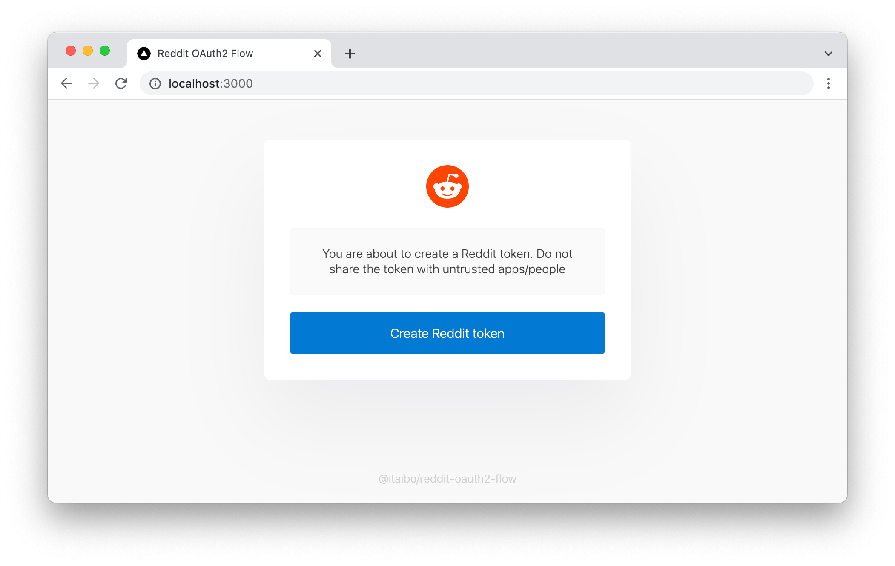

## Reddit OAuth2 Flow
Next.js application to get Reddit tokens using their [OAuth2 flow](https://github.com/reddit-archive/reddit/wiki/OAuth2)

## Why use this?
When creating a CLI application, you need your user's token to manage their Reddit account. This UI lets your user get their token in a friendly and easy way. Then, they can copy/paste their token into your application

## Configuration
To work properly, some environment variables are required. You will need to [create a Reddit app](https://www.reddit.com/prefs/apps)

|Environment variable|Description|
|---|---|
|`NEXT_PUBLIC_REDDIT_CLIENT_ID`|Your Reddit's app client id|
|`REDDIT_CLIENT_SECRET`|Your Reddit's app client secret|
|`NEXT_PUBLIC_REDIRECT_URI`|Your Reddit's app redirect uri, that must be the same as the URL you are deploying this application to. Remember to append `/callback`. Will look like `https://your-deployment.vercel.app/callback`|
|`NEXT_PUBLIC_TOKEN_DURATION`|Either `temporary` or `permanent`. Learn more in the [Reddit OAuth2 specification](https://github.com/reddit-archive/reddit/wiki/OAuth2#authorization)|
|`NEXT_PUBLIC_TOKEN_SCOPE`|A space separated list of scope string. Get the list of scopes and learn more in the [Reddit OAuth2 specification](https://github.com/reddit-archive/reddit/wiki/OAuth2#authorization)|

## Contributing
Contributions are welcomed!

## Attribution
If you deploy the app, or create your own customizations, please consider keeping the attribution to this repository located in the footer
